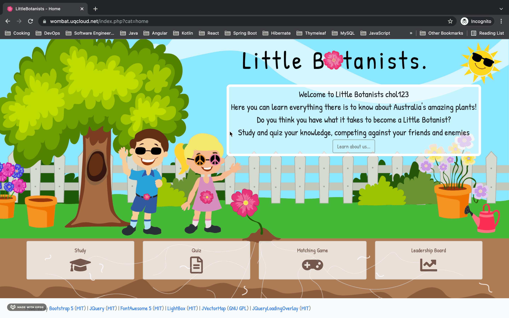
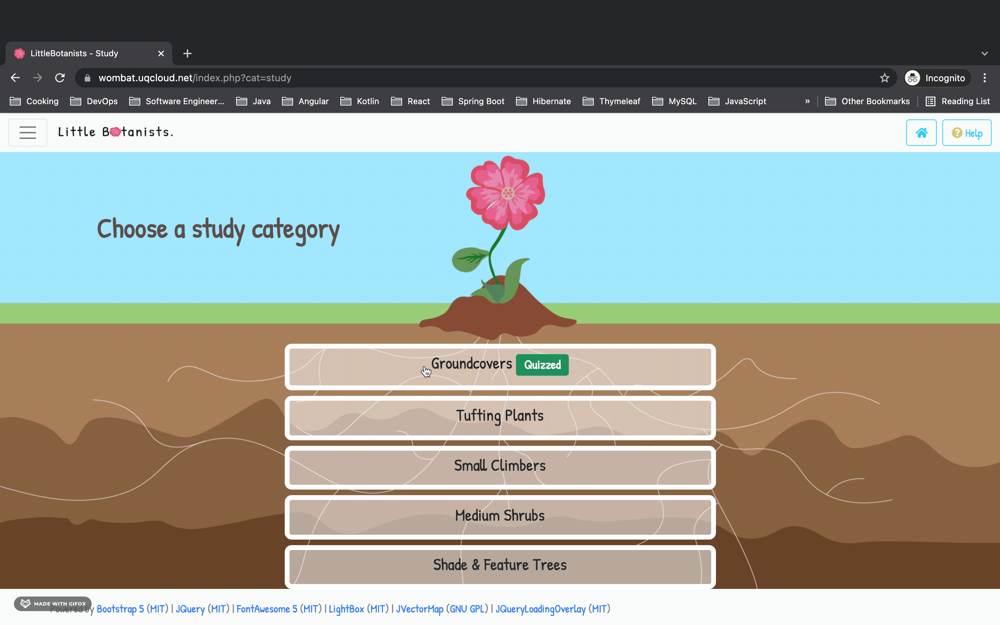
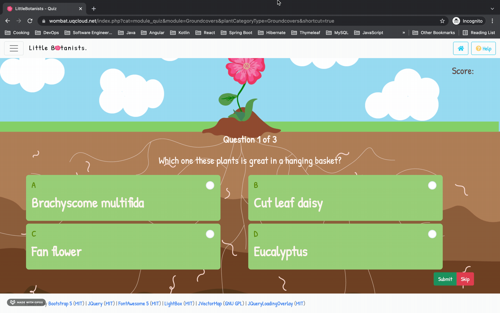
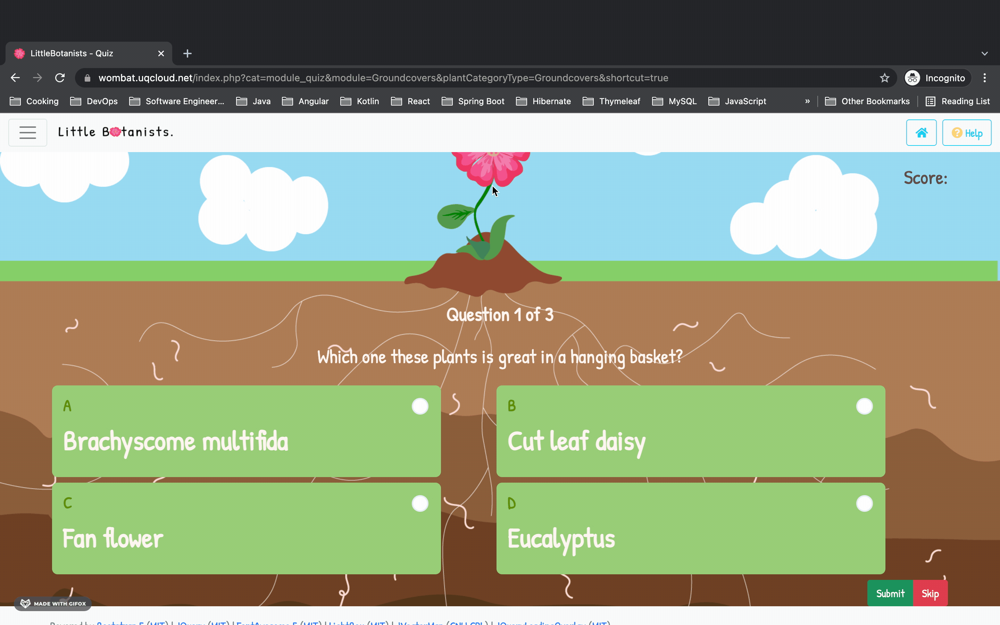
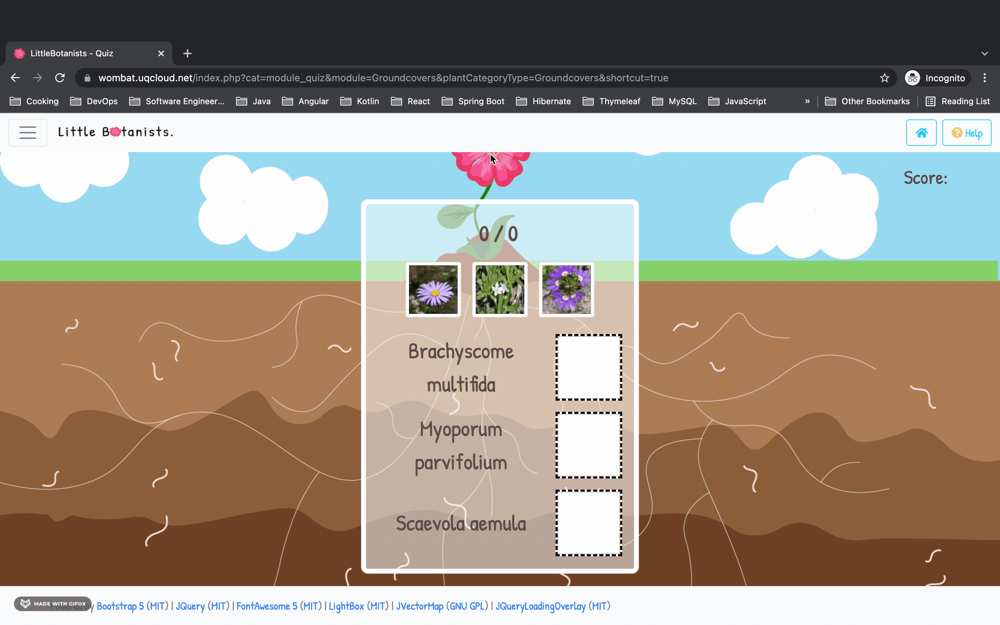
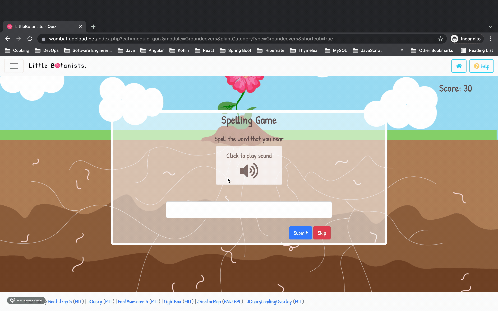
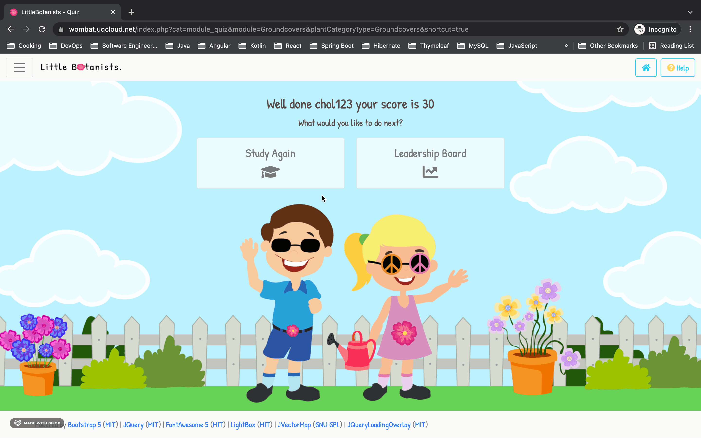
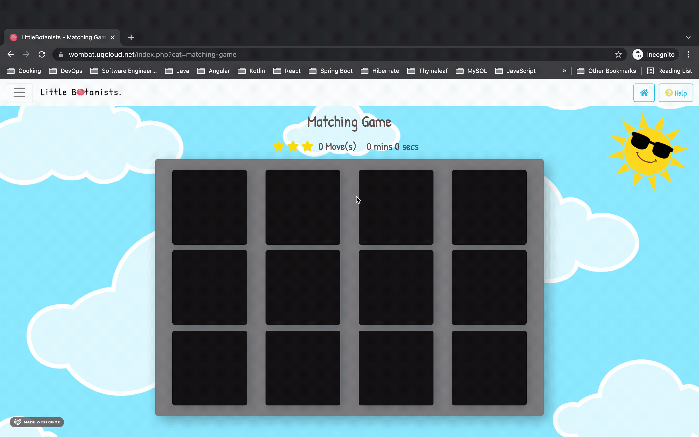

# Little Botanists

An educational web application for DECO1800. I collaborated within a team of 5. My main role was leading the development process.
Helping assign tasks to other members and onboarding them onto their tasks when I saw fit. I was in charge of setting up the development environments and selecting the technologies to use for the project.
The technologies we chose were:
* Docker (to simplify dev environment)
* PHP
* JQuery
* Bootstrap 5
* LightBox2
* FontAwesome5
* JVectorMap
* and more Open Source stuff

If you are a student at UQ you can view our site at: https://wombat.uqcloud.net

Surprisingly our project was nominated for best UX and UI for ITEE awards which unfortunately we didn't win.

> Little Botanists aims to excite, inform, and educate Australian primary school students aged 10 to 12 about common native flora. Little Botanists is an existing alternative to teach what could be otherwise stale content to a younger demographic.

> Seeking knowledge to understand concepts has been deeply integrated into the web-based application through the creation of a fun and engaging environment. Interactive learning is encouraged through various features, entailing quizzes and matching games where students can compete against one another for the highest score!

> Disclaimer:Care has been taken to ensure that the images of plants returned by GBIF API are appropriate for the target audience.

> Assumptions and standpoints: For the spelling game we assume the student is able to hear sounds to play. Other interactive features such as the Matching Game, Drag & Drop and Quiz should be suitable for all students.
## Final Product Screenshots
These are sample screenshots and do not reflect the entire app
### Home & Name
When the user first comes to the site we ask for a nick name to personalize things for them.

### Study
The study section allows students to learn about the various native plants in specific categories.

### Quiz
The quiz section allows the student to test their knowledge.

### Score
We wanted to encourage students to compete with their peers.So a leaderboard system was incorporated.

### Matching Game (Bonus)
We added a matching game for children to reinforce their knowledge of plants by matching cards.
This is a memory game once you flip a card you must find one that matches with it. Both cards close when they don't match. When all cards have been matched the game ends.

## Important things

#### Windows (Editing hosts file)

1. Run notepad as Administrator
2. Open the file C:\Windows\System32\Drivers\etc\hosts (At the bottom of the file dialog choose "All Files" if you don't see hosts file)
3. Add the line `127.0.0.1       local.littlebotanists.com.au` to the bottom of the file.
4. Save and Exit

#### Mac/Linux (Editing hosts file)

1. Open your terminal
2. Use either vim or nano to edit the file `vim /etc/hosts` or `nano /etc/hosts`
3. Add the line `127.0.0.1       local.littlebotanists.com.au` to the bottom of the file.
4. Save and Exit
## Development

### Starting the development
In the root of the project, in a terminal type:

`docker-compose up -d`

This will start the docker containers the app needs to run

#### Accessing the application

Visit http://local.littlebotanists.com.au:8084/

